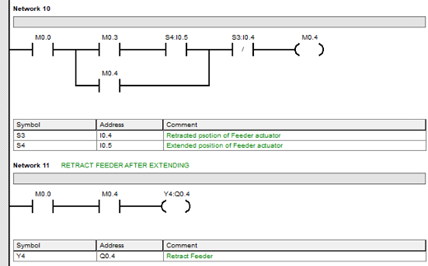

# Automated Object Sorting System using PLC & Pneumatic Actuators

Developed an automated sorting system using PLC-based control and electro-pneumatic actuation to categorize objects based on color, material, and transparency. The system features a motor-controlled conveyor belt and a sensor-driven sorting mechanism.

## Key Features

- **PLC-Controlled Automation:** Designed a PLC-controlled automation system integrating sensors and actuators.
- **Conveyor Belt System:** Implemented a 1-meter conveyor belt system with a pneumatic feeder mechanism.
- **Ladder Logic Programming:** Developed ladder logic programs for Siemens S7-200 PLC to automate sorting.
- **Industrial Sensors:** 
  - **Photoelectric Sensors (QS18EN6XLPC):** For transparent object detection.
  - **ColorSight™ Sensors (46CLR):** For color-based sorting.
  - **Capacitive Sensors:** For object presence detection.
- **Pneumatic Actuators:** Integrated single and double-acting pneumatic actuators for sorting mechanisms.
- **Simulation & Testing:** Simulated system performance in FluidSim before real-world testing and conducted real-time testing and adjustments in a controlled lab environment.

## Tools & Technologies

- **Programmable Logic Controllers (PLC):** Siemens S7-200
- **Ladder Logic Programming:** Industrial Automation
- **Simulation Software:** FluidSim (for pneumatic circuit simulation)
- **Electro-Pneumatics:** Control of sorting actuators
- **Industrial Sensors:** Reflex light beam, color, and capacitive sensors

### FluidSim Circuit Simulation

**Figure 1:** FluidSim Circuit Simulation  

### Ladder Programming Logic for Siemens S7-200 PLC

**Figure 2:** Ladder Logic 1 

**Figure 3:** Ladder Logic 2 

**Figure 4:** Ladder Logic 3  

**Figure 5:** Ladder Logic 4  

**Figure 6:** Ladder Logic 5

